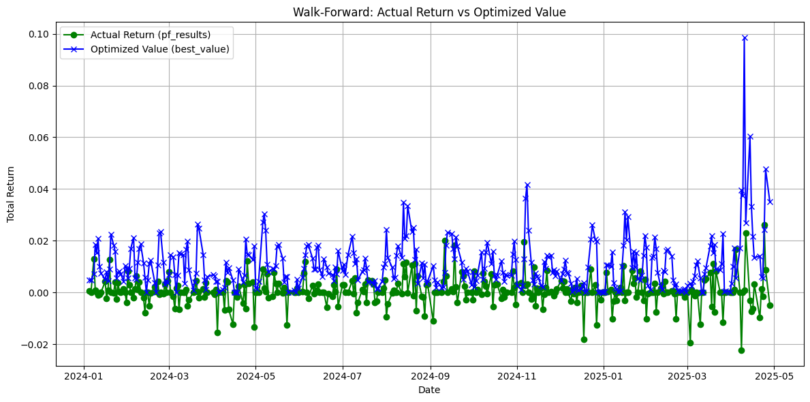
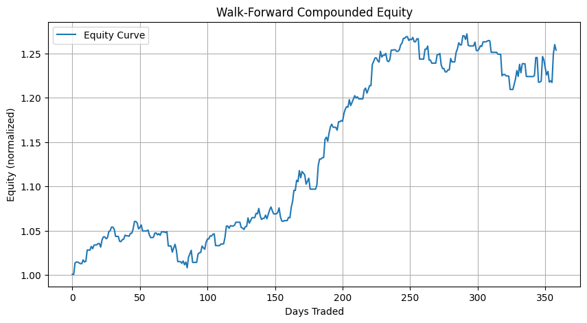
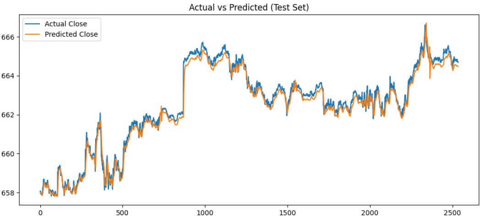
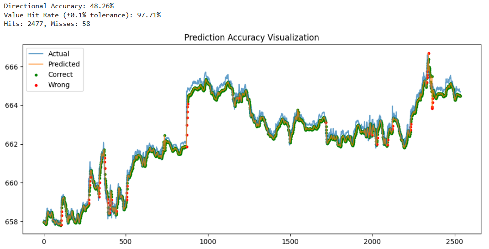

# Trading Strategy Framework

[](https://www.python.org/)
[](https://alpaca.markets/)
[](https://github.com/twopirllc/pandas-ta)
[](https://finance.yahoo.com/)
[](https://matplotlib.org/)

This repository provides a modular Python framework for fetching, analyzing, and visualizing stock data, as well as implementing and testing different trading strategies using **Alpaca API**, **pandas-ta**, and **matplotlib**.

---

## 📊 Features

- Fetch historical stock data from **Alpaca API**
- Automatic cleaning of non-trading days and missing data
- Built-in technical indicators using `pandas-ta`
- Customizable trading strategies:
  - Simple Moving Average (SMA) Crossover
  - Exponential Moving Average (EMA) Crossover
  - Relative Strength Index (RSI)
  - Moving Average Convergence Divergence (MACD)
- Candlestick and signal visualization
- Trade plotting with entry/exit markers

---

## Example Screenshots

```bash
Date from: 2024-01-01
Date to: 2025-04-30

```




## Neural Network Implementation

```bash
1 minute timeframe - Predicts the next 1 minute price close
Date from: 2025-09-01
Date to: 2025-10-01
```




---

## ⚙️ Requirements

Install dependencies using:

```bash
pip install pandas numpy matplotlib pandas-ta yfinance alpaca-py scipy mplfinance
```

You will also need to set your Alpaca API credentials as environment variables:

```bash
export API_KEY="your_api_key"
export API_SECRET="your_api_secret"
```

---

## 🚀 Usage

### 1. Fetch Stock Data

```python
df = get_stock_data("AAPL", start_date="2023-01-01", end_date="2023-12-31")
```

### 2. Apply a Strategy

```python
from strategies import SMACrossoverStrategy

strategy = SMACrossoverStrategy(fast=10, slow=50)
df = strategy.generate_signal(df)
strategy.plot_trades(df)
```

### 3. Visualize Data

```python
plot_candlestick_with_volume(df, "AAPL")
plot_price_with_signals(df, indicators=["SMA_10", "SMA_50"])
```

---

## 🧠 Strategy Classes

Each strategy inherits from the base `Strategy` class and implements the `generate_signal()` method to produce buy/sell signals.

| Strategy | Description |
|-----------|--------------|
| **SMACrossoverStrategy** | Uses fast and slow moving averages to detect bullish or bearish trends |
| **EMACrossoverStrategy** | Similar to SMA but more responsive to recent data |
| **RSIStrategy** | Generates signals based on overbought/oversold RSI levels |
| **MACDStrategy** | Uses MACD and signal line crossovers |

---

## ✅ To-Do Progress

- [x] Connect to Alpaca API and fetch historical stock data  
- [x] Clean and preprocess data (remove missing values, non-trading days)  
- [x] Implement base framework for trading strategies  
- [x] Add SMA, EMA, RSI, and MACD strategy classes  
- [x] Create visualization utilities (candlestick charts, buy/sell markers, signal overlays)  
- [x] Test strategies on historical data for validation  
- [x] Add configurable parameters (start/end date, timeframe, symbol)  

### 🔄 Current Stage
- [x] Integrate **LSTM-based stock price prediction** using TensorFlow  
- [x] Evaluate model performance (RMSE, MAE, Directional Accuracy)  
- [ ] Optimize model hyperparameters (epochs, window size, batch size)  
- [ ] Improve data pipeline for multi-timeframe support (1m, 5m, 15m, 1h)  
- [ ] Merge ML predictions with strategy signals for hybrid decision-making  

### 🚀 Upcoming Tasks
- [ ] Implement **backtesting engine** for automated performance evaluation  
- [ ] Add portfolio and risk metrics (Sharpe ratio, win rate, drawdown)  
- [ ] Extend support for cryptocurrencies and forex pairs  
- [ ] Create configuration file (`config.yaml`) for easy parameter tuning  
- [ ] Build a CLI interface to run different strategies and models  
- [ ] Integrate Plotly for interactive visualizations  
- [ ] Add live trading simulation with paper trading API  
- [ ] Write unit tests for core modules (`data_fetch`, `strategies`, `visuals`)  
- [ ] Improve documentation and add code examples  
- [ ] Deploy web dashboard for results visualization (e.g., Streamlit or Flask)

---

## 🧰 Future Improvements

- Add backtesting framework with performance metrics (Sharpe ratio, win rate, etc.)
- Support for cryptocurrency and forex pairs
- Integration with Plotly for interactive charts
- AI/ML-based signal generation

---

> _*Developed by Mario Portillo*_
